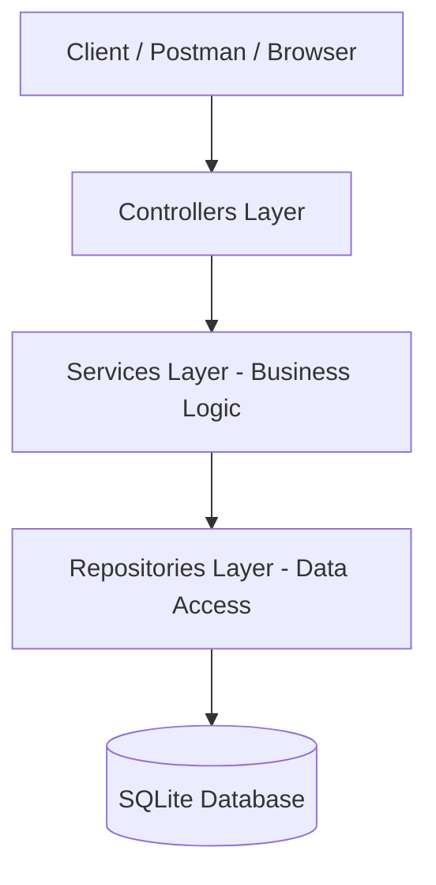

# CP2 SOA

Este projeto é uma API REST para gestão de reservas de hotel, desenvolvida para a disciplina de SOA.

## 🛠️ Tecnologias Utilizadas
- **Node.js** com **TypeScript**
- **Express.js** (Framework Web)
- **Prisma ORM** (Persistência)
- **SQLite** (Banco de Dados local)
- **Zod** (Validação de DTOs)
- **Swagger UI** (Documentação)

## 🏗️ Arquitetura
O projeto segue uma arquitetura em 3 camadas, conforme solicitado:



### Decisões de Arquitetura (ADRs)

#### ADR 1: Escolha da Stack (TypeScript + Prisma)
- **Contexto**: Necessidade de um sistema tipado com gestão de banco de dados versionada.
- **Decisão**: Utilizamos TypeScript para segurança de tipos e Prisma ORM para migrações automatizadas.
- **Consequência**: Código mais robusto, menos erros em tempo de execução e banco de dados sempre sincronizado.

#### ADR 2: Arquitetura em 3 Camadas (Controller-Service-Repository)
- **Contexto**: Requisito do PDF para separação de responsabilidades.
- **Decisão**: Controllers lidam com HTTP, Services com as Regras de Negócio e Repositories com o Prisma.
- **Consequência**: Facilidade de manutenção e testabilidade de cada parte isoladamente.

#### ADR 3: Tratamento de Erros Centralizado
- **Contexto**: Requisito de payload de erro padronizado com código, mensagem e timestamp.
- **Decisão**: Implementamos um middleware global no Express para capturar exceções e formatar a resposta.
- **Consequência**: Respostas de erro consistentes em toda a API.

## 🚀 Como Executar

### 1. Instalar dependências
```bash
npm install
```

### 2. Configurar Banco de Dados (Migrações e Seed)
```bash
npx prisma migrate dev --name init
npx prisma db seed
```

### 3. Rodar em modo de desenvolvimento
```bash
npm run dev
```
Acesse a documentação em: `http://localhost:3000/api-docs`

## 📖 Exemplos de Requisição

### Criar Reserva (POST `/api/reservations`)
**Request:**
```json
{
  "guest_id": "11111111-1111-1111-1111-111111111111",
  "room_id": "aaaaaaaa-aaaa-aaaa-aaaa-aaaaaaaaaaaa",
  "number_of_guests": 2,
  "checkin_expected": "2025-11-20T00:00:00Z",
  "checkout_expected": "2025-11-22T00:00:00Z"
}
```
**Resposta Esperada (201 Created):**
```json
{
  "id": "uuid-da-reserva",
  "status": "CREATED",
  "estimated_amount": 500.00
}
```

### Erro de Capacidade Excedida
**Request (3 hóspedes para quarto de 2):**
```json
{
  "guest_id": "...",
  "room_id": "id-quarto-standard",
  "number_of_guests": 3,
  "checkin_expected": "...",
  "checkout_expected": "..."
}
```
**Resposta Esperada (400 Bad Request):**
```json
{
  "error": "CapacityExceededException: Number of guests exceeds room capacity",
  "timestamp": "2026-05-13T...",
  "path": "/api/reservations"
}
```

## ✅ Regras de Negócio Implementadas
- **InvalidDateRangeException**: Saída deve ser após a entrada.
- **RoomUnavailableException**: Bloqueio de sobreposição de datas.
- **CapacityExceededException**: Validação de hóspedes vs capacidade.
- **InvalidReservationStateException**: Controle de transições de status.
- **Check-in Window**: Apenas na data prevista.
- **Cálculo Automático**: Preços baseados em diárias.
